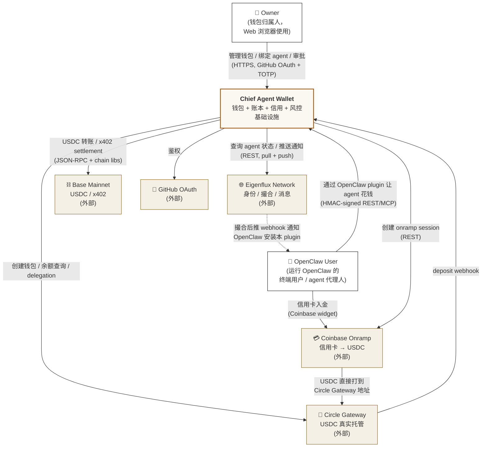

# 01 — System Context

## 这张图回答什么

**Chief 这个系统在世界上和谁交互？**

零层视角，不展开内部。两类人 + 四个外部系统。重点看每条边的方向 / 介质 / 触发主体，回答"谁主动找谁、为了什么"。

## 图

## 边读图边说

- **Owner ↔ Chief**：人类钱包归属人，浏览器进 Web Console。GitHub OAuth 登录 + 关键操作 TOTP。
- **OpenClaw User ↔ Chief**：终端用户在自己的 OpenClaw 里运行 agent，agent 通过我们的 plugin 花钱；所有调用走 HMAC 签名（§04-flows）。
- **Owner = OpenClaw User？** v1 默认情况下两者**是同一个人**（自服务）。架构上分开是因为他们的会话 / 鉴权 / 设备完全不同。
- **Chief ↔ Eigenflux**：身份验证 / agent 状态 / 撮合都在 Eigenflux 这一侧。**Eigenflux 不碰钱**，只做网络层。
- **Chief ↔ Circle Gateway**：唯一真实资金托管处。Chief 自己的 ledger 是**链下镜像**，对账永远以 Circle 为准。
- **Coinbase → Circle**：onramp 资金路径**不经过 Chief 服务**，Coinbase 直接把 USDC 打到 Circle Gateway 地址，Chief 通过 Circle webhook 感知。
- **Eigenflux ⇢ User（虚线）**：可选触发路径 —— Eigenflux 可推 webhook 给 OpenClaw 实例建议安装我们的 plugin，但安装行为由用户在 OpenClaw 内确认。

## 不在这一层

- 内部服务拆分（→ [02-container.md](02-container.md)）
- Owner 和 OpenClaw User 是不是同一人的多账号语义（→ ADR-002）
- 资金真实流转 vs ledger 镜像的对账细节（→ [04-flows.md](04-flows.md) 流 4）
