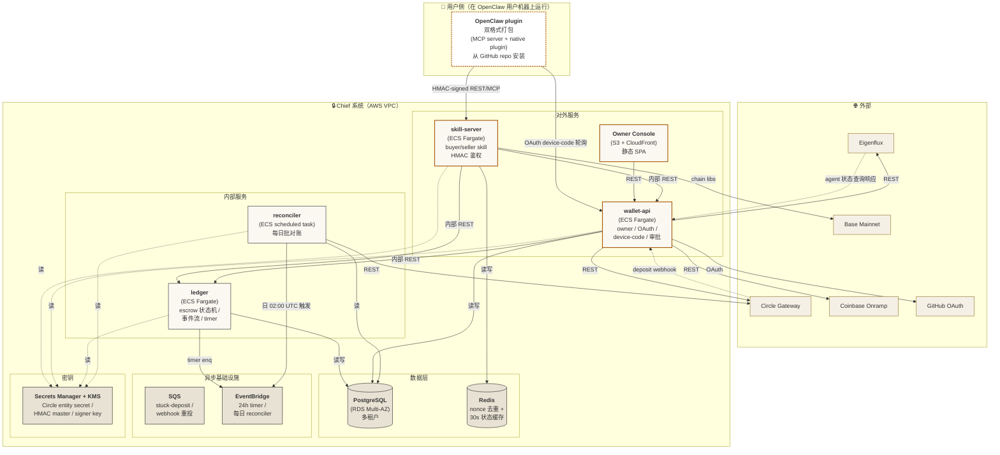

# 02 — Container Diagram

## 这张图回答什么

**Chief 系统内部由哪些可独立部署 / 独立扩缩 / 有自己进程边界的东西组成？**

这张图把 [01-context.md](01-context.md) 的"Chief 一个盒子"拆开看到所有 service / datastore / queue。但**不展开每个 container 内部**。各 container 内部到 [03-components/](03-components/)。

## 图

## 边读图边说

### 三类 container

- **对外服务**（attack surface）：`skill-server`（agent 调）+ `wallet-api`（owner 调）+ `Owner Console`（静态前端）
- **内部服务**（不暴露公网）：`ledger`（金钱真理源）+ `reconciler`（一致性守门人）
- **数据 / 异步基础设施**：PostgreSQL / Redis / SQS / EventBridge / Secrets Manager

### 一些关键约束

1. **`ledger` 不直接对外**：所有写入必须经过 `wallet-api` 或 `skill-server`，便于鉴权 / 审计 / 风控集中。
2. **资金真理源是 Circle**：`reconciler` 每日比对 PG 与 Circle，差异 > $10 触发平台 freeze（→ ADR-008）。
3. **HMAC 鉴权层在 `skill-server`**：所有 plugin 请求第一层就在这里挡。Eigenflux ID 仅用于 metadata，不参与授权（→ ADR-003）。
4. **Plugin 是用户侧产物**：`OpenClaw plugin` 不部署在我们 AWS 里，部署在用户机器上，但代码归我们维护，CI/CD 推 GitHub release。
5. **chain libs 内嵌在 `skill-server`**：x402 buyer / Circle USDC 转账 / risk policy 都是 npm 包，不独立成服务。

### 容器拆分依据

| Container | 为什么不能合并到隔壁 |
|---|---|
| `skill-server` ↔ `wallet-api` | 一个对 agent 一个对 owner，鉴权链 / 流量曲线 / SLA 都不同；多租户 + mainnet 上线后扩缩容步调不一致 |
| `ledger` 独立 | v1 邀请制写入量小，但 ledger 是事务型（一次 lock / release 必须强一致），单独跑利于横向扩 / 更严的 SLO |
| `reconciler` 独立 | 仅每天 02:00 UTC 跑一次 + 手动触发，跑长事务，独立任务避免和实时服务争资源 |
| `Console` 独立 | 完全静态，CloudFront + S3 即可，跟应用层没有运行时耦合 |

## 不在这一层

- 每个 container 内部如何拆模块（→ [03-components/](03-components/)）
- 部署所在的 AZ / 子网 / IAM（→ [05-deployment.md](05-deployment.md)）
- 业务流程的时序（→ [04-flows.md](04-flows.md)）
