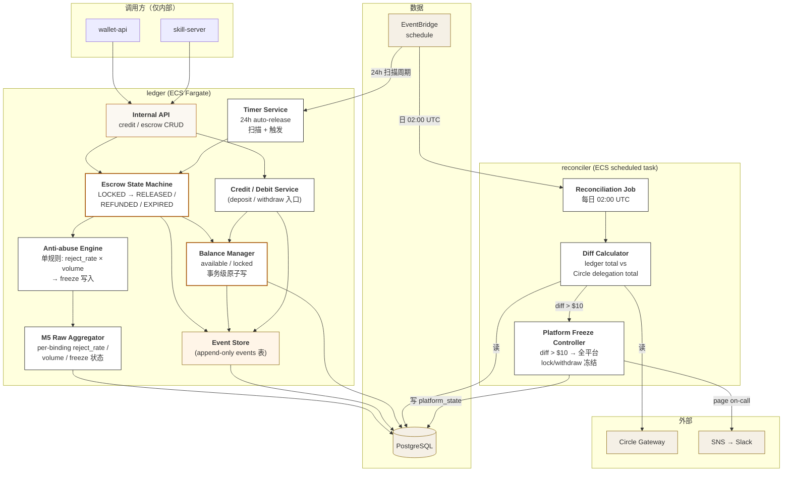

# 03 — Component / `ledger` (+ `reconciler`)

## 这张图回答什么

**唯一的金钱状态机长什么样？timer 谁触发？事件流怎么落？**

`ledger` 是 Chief 的金钱真理源。任何"钱动了一下"的写入都必须经过它，且必须**事务性**：要么 ledger 写成功，要么完全不发生。`reconciler` 是它的下游守门员，每天比对外部托管真值。

## 图



## 关键说明

### Escrow 状态机 + Balance Manager 是同一个事务

`escrows` 状态变化和 `balances`（available / locked）的变化必须在**同一个 PG 事务**里完成。任何中间故障都不能让"钱锁了但 escrow 没记上"或反向。

```sql
BEGIN;
  UPDATE escrows SET state='LOCKED', locked_at=now() WHERE id=$1;
  UPDATE balances SET available = available - $2, locked = locked + $2 WHERE wallet_id=$3;
  INSERT INTO events (binding_id, event_type, ...) VALUES (...);
COMMIT;
```

### Event Store 是 append-only

`events` 表**永不更新**，仅追加。这是：
- M5 raw 聚合的输入源
- Audit log 的存储面
- Reconciliation 调查时的回放素材

任何"修复历史数据"操作必须新增反向事件，不能 UPDATE 旧记录。

### Timer Service 不是单独 cron

24h auto-release 用 EventBridge schedule 每分钟扫一次 `escrows WHERE state='LOCKED' AND expires_at < now()`，命中即触发状态转换 `LOCKED → EXPIRED → RELEASED`。

不用 PG 触发器、不用进程内 setTimeout —— 重启 / scale-out 都不能漏 timer。

### Anti-abuse 与 M5 Aggregator 实时性

Anti-abuse 单规则在每次 `escrow.RELEASED` / `REFUNDED` 终态后**同步**重算受影响 binding 的 `reject_rate`。命中阈值 → 直接写 `bindings.frozen_as_seller=true`。这是同步的、事务内的。

不做"批处理后冻结" —— 因为冻结晚一秒就可能再被锁一笔钱。

### Reconciler 的"门"

`reconciler` 不只是一个 monitoring 任务，它是 v1 的最后一道**主动停机闸门**：

```
diff 阈值       动作
≤ $0.01        log，过
≤ $10          warning，page Slack
> $10          写入 platform_state.frozen=true
              → wallet-api / skill-server 后续所有 lock / withdraw 直接拒绝
              → page on-call 立即介入
```

详见 ADR-008。

## 不在 `ledger` 里

- Onramp / withdraw 的外部调用（→ `wallet-api`）
- HMAC 鉴权（→ `skill-server`）
- Circle webhook 签名验证（→ `wallet-api`）
- M5 评分模型（v2，v1 仅 raw）
