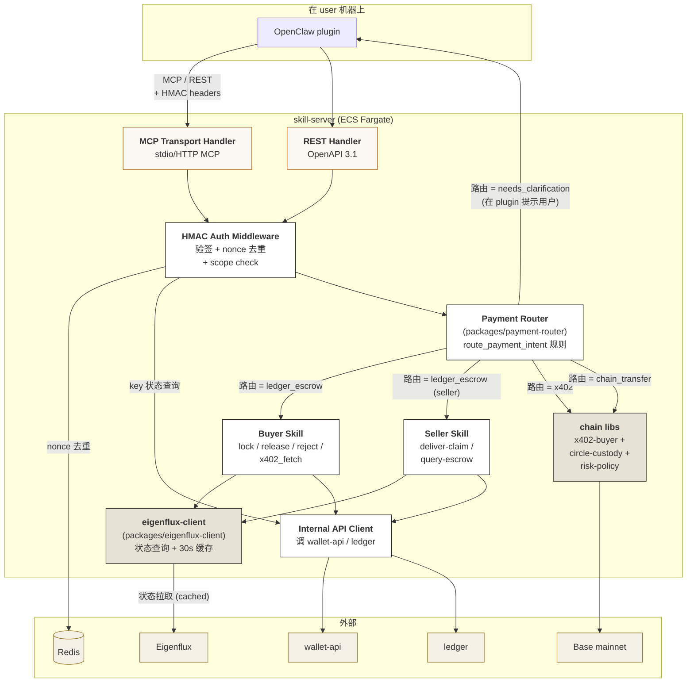

# 03 — Component / `skill-server`

## 这张图回答什么

**`skill-server` 这个 container 内部由哪些模块组成？请求进来到出去经过哪几跳？**

聚焦 plugin → skill-server 这一条对外热路径。

## 图



## 关键说明

### 请求路径（happy path：buyer N2 Lock）

```
plugin → MCP/REST handler → HMAC auth middleware
       → payment router 决定走 ledger_escrow
       → buyer skill
       → eigenflux-client（查 buyer agent 状态 active 否，可能 cache 命中）
       → internal api client → ledger（创建 escrow）
       → 返回 code = success / pending_approval / failed_xxx
```

### 模块职责

- **MCP Transport / REST Handler**：协议适配层，把 stdio MCP / HTTP REST 都归一化成内部 RPC 形态
- **HMAC Auth Middleware**：v1 唯一资金授权门，验 timestamp / nonce / signature / key 状态 / scope
- **Payment Router**：从原 `route_payment_intent` 提炼的规则，决定一次"花钱意图"走哪条路（ledger / x402 / 链上 / 需要澄清）
- **Buyer Skill / Seller Skill**：业务编排，按路由结果调相应下游
- **eigenflux-client（lib）**：包装 Eigenflux REST，加 30s 状态缓存（Eigenflux 仅 pull → 缓存防止每次锁钱都打远端）
- **chain libs**：x402 buyer / Circle 链上 USDC 转账 / risk policy caps；都是同进程 lib，不是远程调用
- **Internal API Client**：唯一对内服务调用入口，统一超时 / 重试 / 错误透传

### 不在 `skill-server` 里

- Owner 域操作（→ `wallet-api`）
- 实际 escrow 状态机（→ `ledger`）
- 24h auto-release timer（→ `ledger` 内部 + EventBridge 触发）

### 关键 SLO（v1 草拟）

| 指标 | 目标 |
|---|---|
| HMAC 鉴权 p99 | < 30ms |
| `escrow.lock` 端到端 p99 | < 800ms（含 Eigenflux 查询缓存命中） |
| `escrow.lock` 端到端 p99（缓存 miss） | < 1500ms |
| `x402 fetch` p99 | 取决于 seller，Chief 自身开销 < 200ms |
