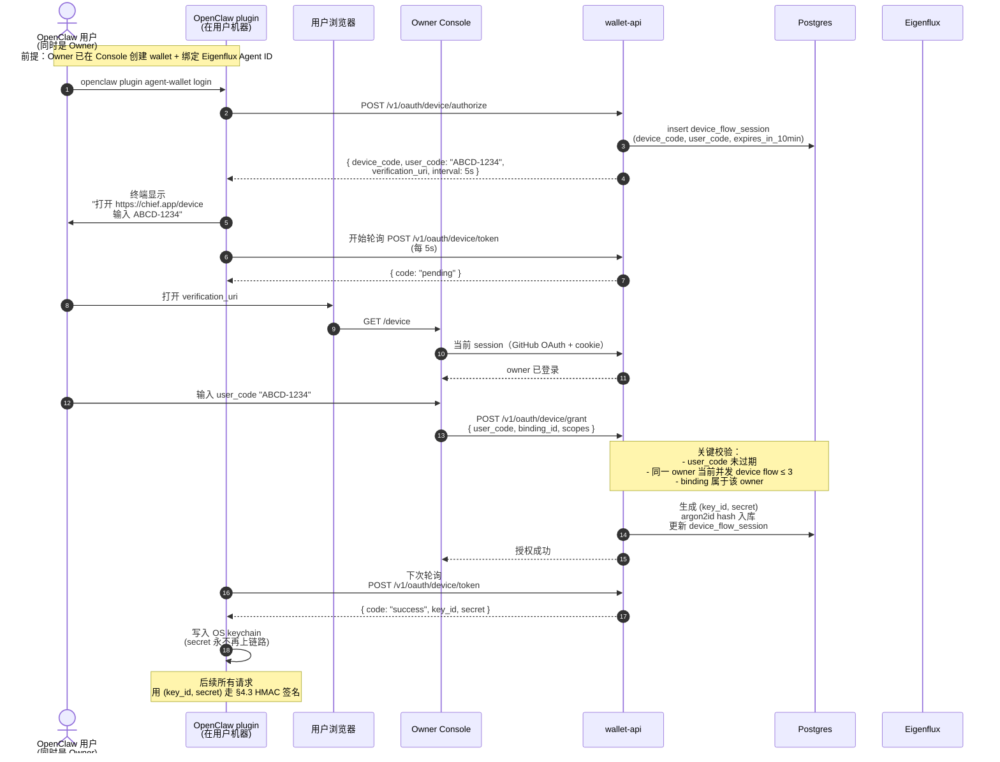
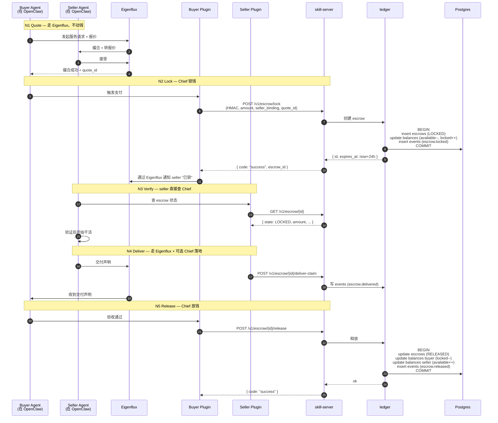
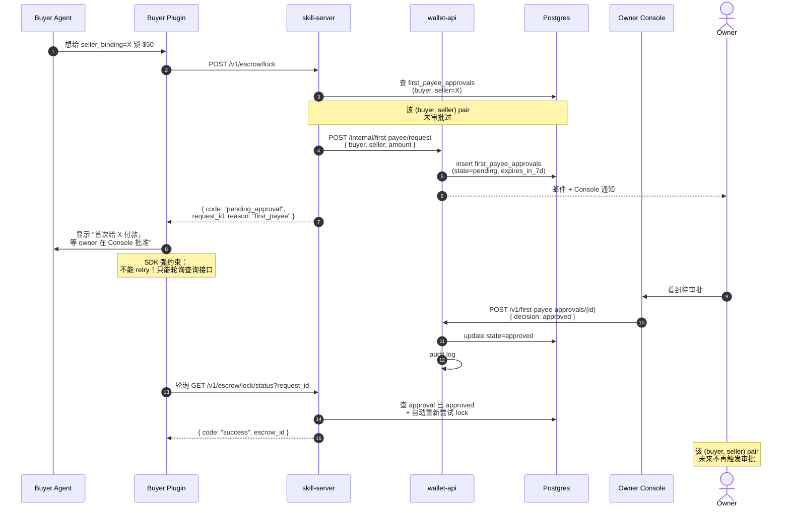
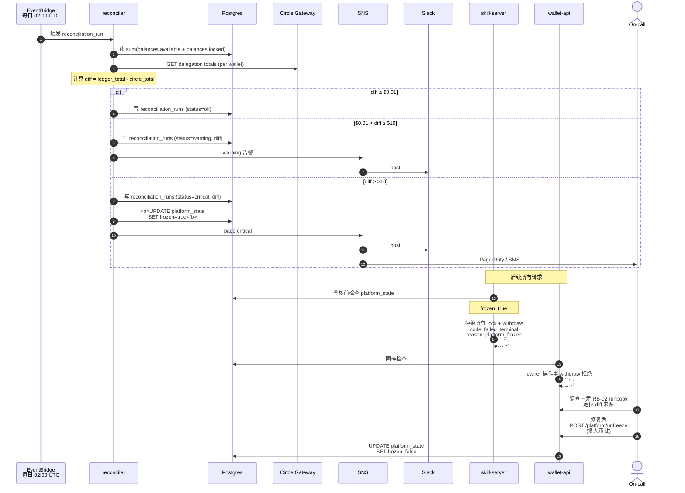

# 04 — Key Business Flows

按 v1 真实使用顺序排：先把 plugin 装上 + 拿到凭证（Flow 1），然后才是花钱（Flow 2、3），最后是平台守门（Flow 4）。

每个 flow 一张时序图，专注一件事，重点高亮**异常 / 安全相关分支**。

---

## Flow 1：OpenClaw plugin 首次登录（OAuth device-code）

### 这张图回答什么

**用户从"装好 plugin"到"plugin 拿到凭证开始花钱"经过了哪些跳？凭证怎么不经手 owner 就到 plugin？**

### 关键安全点

- **secret 在响应里只出现一次**，写入 OS keychain 后从内存清掉；DB 仅有 argon2id hash
- **user_code 短 TTL（≤ 10min）+ 并发限制（≤ 3）**——T9 钓鱼攻击的双重防御
- **Console 在 grant 页必须显示**："你正在授权 binding `<eigenflux_agent_id>` (display name: ...) 在 wallet `<id>` 下使用 scope `<lock,release,...>`"，让 owner 主动核对，不能仅靠 user_code 匹配

### 失败分支
- 用户超时未在浏览器输入 user_code → device_code 过期，plugin 收到 `failed_terminal` + `reason=device_code_expired`
- Owner 在 Console 拒绝 → 同 `failed_terminal` + `reason=owner_denied`
- Plugin 短时间内多次发起 device flow → `failed_retryable` + `reason=too_many_concurrent_flows`

---

## Flow 2：A2A Escrow Happy Path（N1 → N5）

### 这张图回答什么

**一笔完整的 A2A 支付里，钱什么时候动、谁触发、ledger 写了几次？**

合并 N1–N5，但聚焦"钱"的视角，不画 Eigenflux 网络上的消息细节。

### 关键观察

- **钱真的动只有两次**：N2 LOCKED 和 N5 RELEASED 在 ledger 各 1 个事务
- **N3 Verify 不走消息**：seller 主动查我们的公开状态接口，不需要 Eigenflux 转发
- **每一次 ledger 写都同时插 event**：M5 raw + audit log 的输入源都来自这里

### 异常分支（同图省略）

- N5 不来 → 24h 后 `escrow.expires_at` 触发 timer，状态 `LOCKED → EXPIRED → RELEASED`（默认信任 seller）
- Buyer N4 主动 reject → `LOCKED → REFUNDED`，buyer 余额回到 available；写 `event=escrow.rejected` 含 reason，进 M5 raw 的 reject_rate 分子

---

## Flow 3：First-payee 审批 Gate

### 这张图回答什么

**buyer 第一次给某个 seller 转钱时，怎么把 owner 拉进来确认？plugin 怎么知道"在等"和"被批了"？**

### 关键点

- **`pending_approval` 不是错误**：plugin 必须把它当成"等待中"而不是"失败" —— 这是 5-tier taxonomy 的灵魂
- **Owner 拒绝路径**：`state=rejected` → plugin 轮询拿到 `failed_terminal` + `reason=first_payee_rejected`
- **7 天未决定 → expired**：plugin 拿到 `failed_terminal` + `reason=approval_expired`
- **批准后该 pair 终生免审批**：除非 owner 主动撤销

---

## Flow 4：Reconciliation Diff > $10 → 平台 Freeze

### 这张图回答什么

**当 ledger 账面和 Circle 真实托管对不上时，系统怎么自动停下来防止扩散？**

### 关键点

- **freeze 是平台级，不是单 wallet 级**：因为 diff 不知道源头是哪个 wallet 之前
- **release 不冻结**：已经 LOCKED 的 escrow 必须能正常 release，否则 buyer 钱被卡
- **解冻必须多人审批**：`POST /platform/unfreeze` 是 admin 端点，不能单人操作（T8 内鬼防御）
- **`reconciliation_runs` 表是历史**：每次跑结果都留痕，便于回放调查

详见 [ADR-008](06-decisions/adr-008-reconciliation-freeze-threshold.md)。
