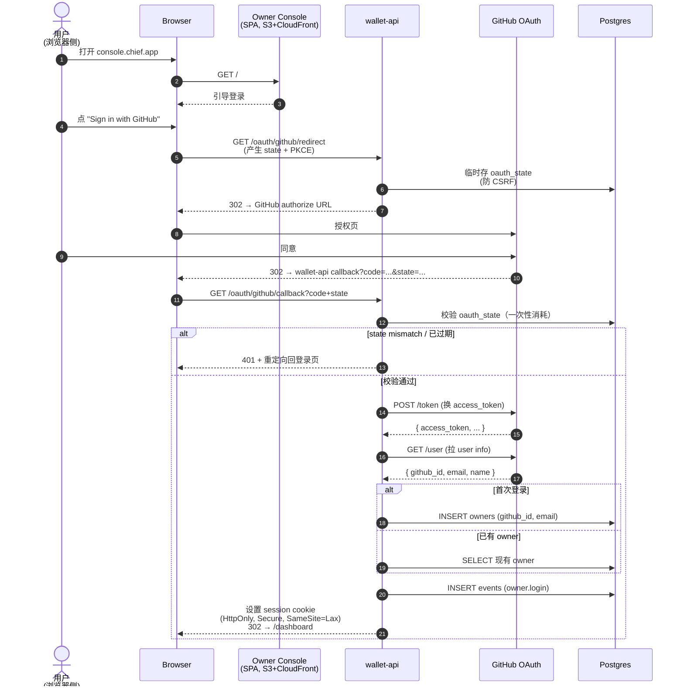
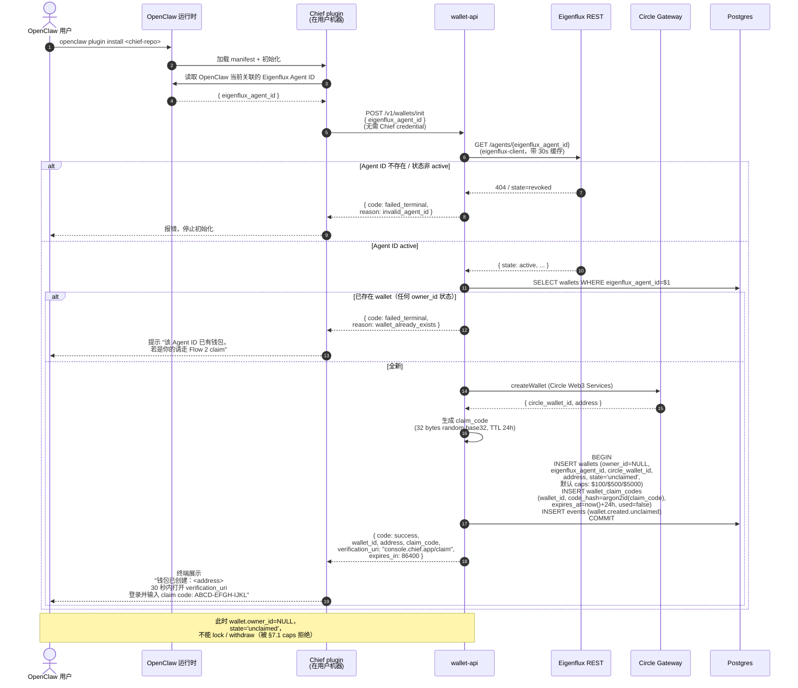
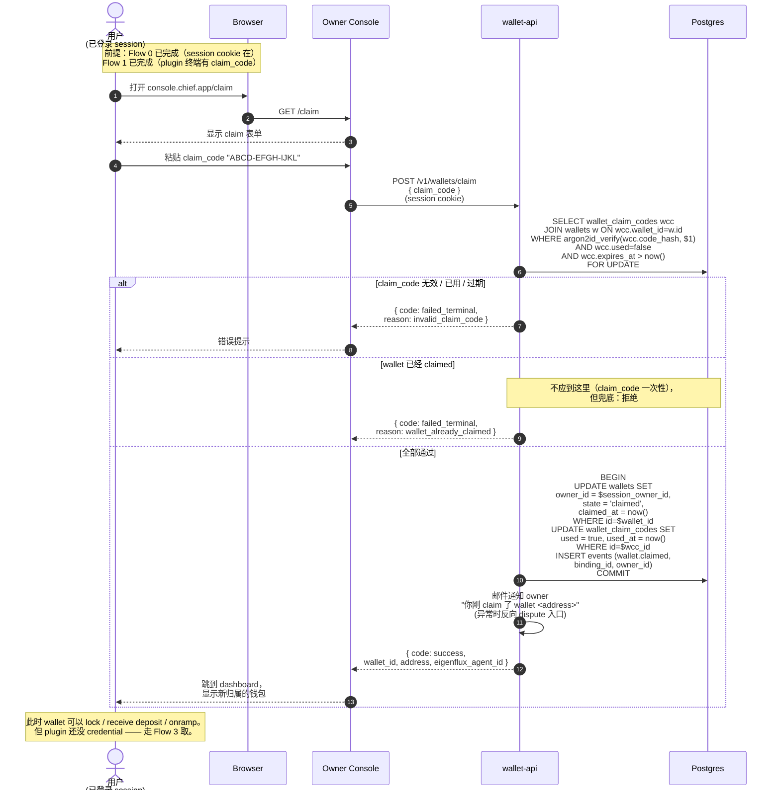
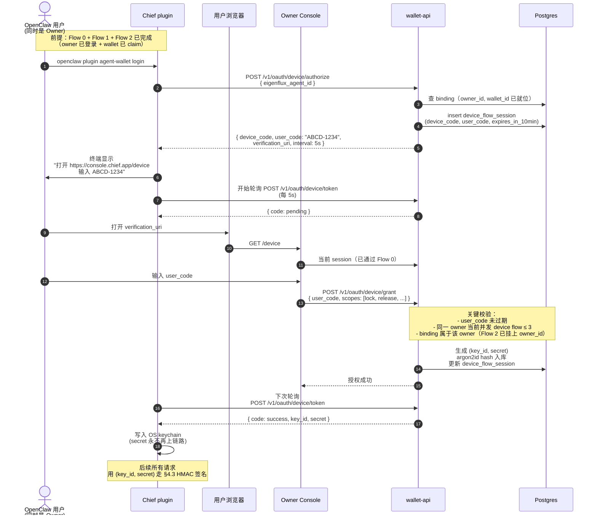
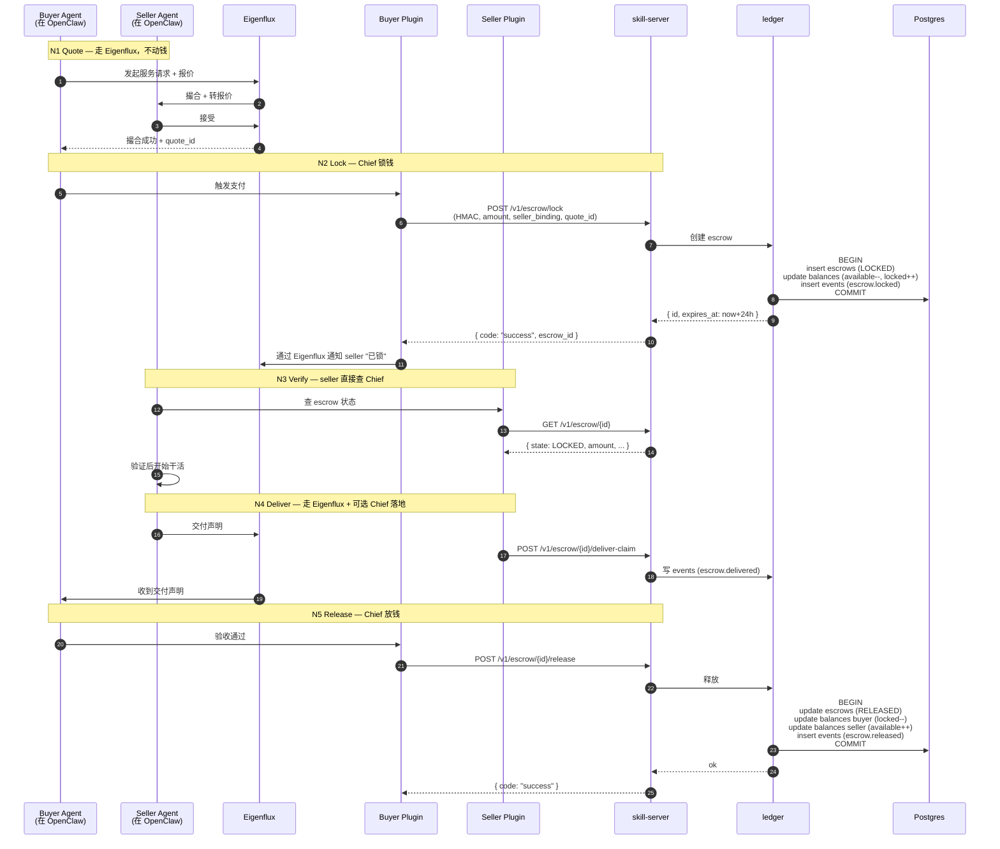
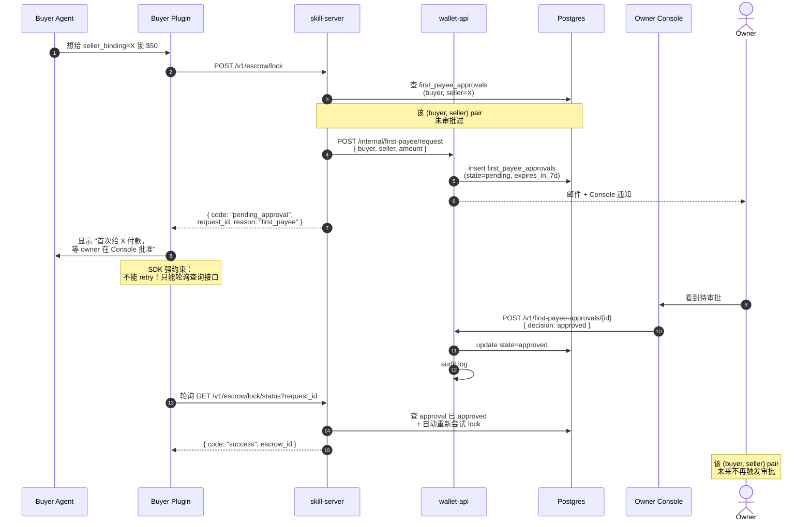
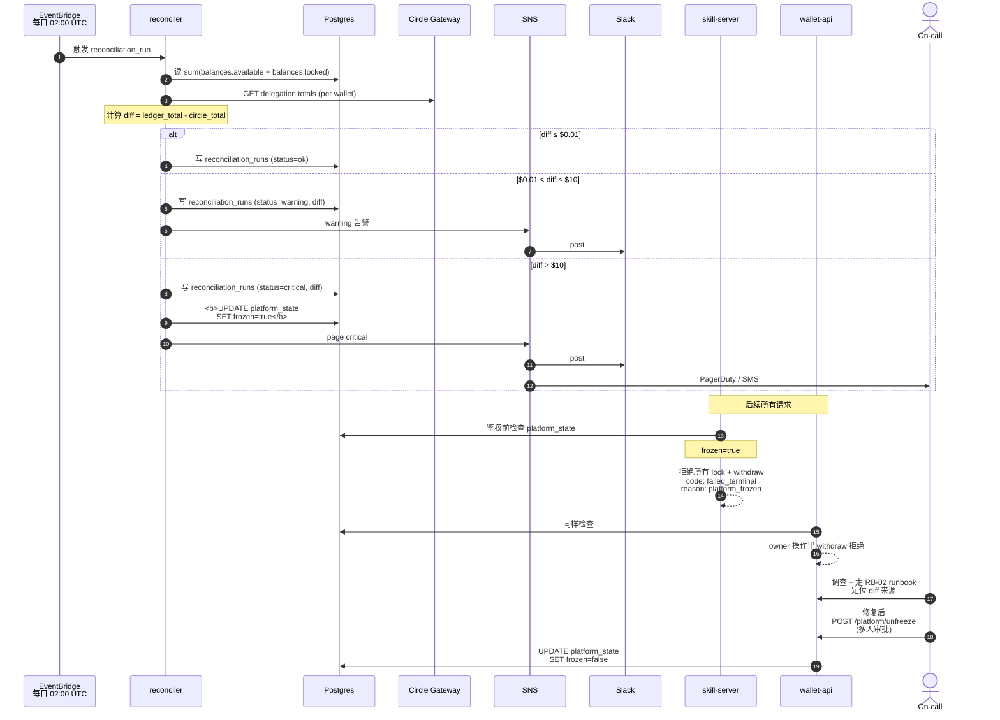

# 04 — Key Business Flows

按时间顺序：用户登录（Flow 0）↔ agent 初始化创建钱包（Flow 1，可在登录前发生）→ 用户 claim 钱包（Flow 2，登录后）→ plugin 取凭证（Flow 3）→ 花钱（Flow 4、5）→ 平台守门（Flow 6）。

每个 flow 一张时序图，专注一件事，重点高亮**异常 / 安全相关分支**。

> **归属模型**：v1 采用"**wallet first, owner later**"（来自原型 M2 叙事）—— wallet 由 agent 初始化时创建（无 owner），由用户登录后凭 claim code 认领。这与"owner-first"的 mainnet 安全直觉**有冲突**，相关风险在 Flow 1 / Flow 2 的"安全考虑"段落显式列出。

---

## Flow 0：用户 OAuth 登录

### 这张图回答什么

**用户从打开 Console 到拿到一个可信的 session 中间发生了什么？这个流程不动钱，纯认证。**

### 关键点

- **state 参数 + PKCE** 强制启用，防 CSRF + 中间人换 code
- **oauth_state 一次性消耗**：DB 行配 unique index，回调时 DELETE RETURNING
- **session cookie**：HttpOnly + Secure + SameSite=Lax；TTL 14 天，Owner 操作里所有"金钱关键路径"额外要 TOTP（withdraw / kill-switch / device-code grant）
- **本流不创建 wallet 也不绑 agent**：这两件事走 Flow 1 / Flow 2

### 失败 / 异常分支

- GitHub 拒绝授权 → 302 回登录页
- state mismatch → 401，记 `event=auth.state_mismatch` 并告警（潜在 CSRF）
- GitHub /user API 超时 → `failed_retryable`，引导用户重试
- 同一 GitHub 账号短时间多次失败登录 → 临时 lockout 5 分钟

---

## Flow 1：Agent 初始化创建钱包（wallet first）

### 这张图回答什么

**OpenClaw plugin 第一次启动时，它如何在 Chief 这边为自己的 Eigenflux Agent ID 准备一个"无主"钱包？claim code 怎么生成？怎么交付给真正的用户？**

### 关键点

- **wallet 出生即归属 Eigenflux Agent ID（不是 owner）**：`wallets.eigenflux_agent_id` UNIQUE 约束保证一个 Eigenflux ID 只能有一个钱包
- **owner_id 可空 + state='unclaimed'**：未 claim 的钱包不能 lock / withdraw（skill-server / wallet-api 在所有花钱路径检查 `state='claimed'`）
- **claim_code 只在响应里出现一次**：DB 仅存 argon2id hash；明文随响应返回，立即在 plugin 端展示给用户后从内存清掉
- **claim_code TTL 24h + 一次性**：超时或被 claim 后失效；plugin 可重发 init 但若已存在 wallet 会被拒
- **本接口无 Chief credential auth**：因为 plugin 在初始化时还没有 credential —— 只能靠 Eigenflux ID 公开识别 + 一次性写约束兜底

### 安全考虑（v1 已知风险）

> **R10（新增）：Eigenflux Agent ID 公开 + 无认证 init = claim_code 抢跑攻击**
>
> 攻击者若知道某个 Eigenflux Agent ID 且**先于合法用户**调 `POST /v1/wallets/init`，能拿到该 ID 对应的 claim_code，再在 Flow 2 用自己的 OAuth session claim 走该钱包。
>
> v1 缓解：
> - Eigenflux Agent ID 在 Eigenflux 网络内是相对受控信息（不公开 list）
> - `wallets.eigenflux_agent_id` UNIQUE → 合法用户晚一步会被告知 "wallet_already_exists"，立即可发现异常
> - claim_code 24h TTL + 一次性 → 攻击窗口有限
> - mainnet 头一个月 Owner Console 在 Flow 2 claim 成功后强制邮件通知 + 24h 内 owner 可"反 claim"（需要 GitHub OAuth + TOTP 双因子）
>
> 长期解法（v1.1+）：
> - Eigenflux 加密码学认证后，wallet init 要求 Eigenflux 签名 envelope
> - 或：init 时用 Eigenflux 推送 webhook 替代 plugin 主动调，把信任锚交给 Eigenflux 网络
>
> 已写入 design.md §11 威胁模型 T10（待补）。

### 失败 / 异常分支

- Eigenflux 不可用 → `failed_retryable`，plugin 退避重试 3 次后停
- Circle createWallet 失败 → `failed_retryable`；entity secret 错误转 `failed_terminal` + page on-call
- 同 Agent ID 已有钱包 → `failed_terminal` + `reason=wallet_already_exists`，引导走 Flow 2

---

## Flow 2：用户登录后 claim 钱包

### 这张图回答什么

**用户走完 Flow 0（拿到 session）+ Flow 1（在 plugin 终端拿到 claim_code）后，怎么把"无主钱包"挂到自己 owner 名下？**

### 关键点

- **`FOR UPDATE` 防并发抢 claim**：两次同时尝试同一 claim_code 时第二次会序列化等待第一次结束，然后看到 `used=true` 而拒绝
- **session 必须存在**：未登录直接 `401`
- **claim 一次性**：成功后 `used=true`，再用同 code 不可
- **claim 后 wallet 可用**：`state='claimed'` 是 lock / withdraw 的前置条件
- **邮件通知 + 24h 反 claim 窗口**（mainnet 头月）：合法用户若发现钱包被他人 claim 走，可在 24h 内通过 GitHub OAuth + TOTP 强制反转所有权（这是 R10 攻击的兜底）

### 失败 / 异常分支

- claim_code 无效 / 已过期 → `failed_terminal`
- claim_code 已被使用 → `failed_terminal`，提示用户该钱包已归属他人，触发 dispute 流程
- 数据库行锁等待超时 → `failed_retryable`

---

## Flow 3：OpenClaw plugin 拿凭证（OAuth device-code）

### 这张图回答什么

**钱包已 claim 后，plugin 怎么拿到 HMAC credential 开始花钱？凭证怎么不经手 owner 就到 plugin？**

### 关键安全点

- **secret 在响应里只出现一次**，写入 OS keychain 后从内存清掉；DB 仅有 argon2id hash
- **user_code 短 TTL（≤ 10min）+ 并发限制（≤ 3）**——T9 钓鱼攻击的双重防御
- **Console 在 grant 页必须显示**："你正在授权 binding `<eigenflux_agent_id>` (display name: ...) 在 wallet `<id>` 下使用 scope `<lock,release,...>`"，让 owner 主动核对，不能仅靠 user_code 匹配
- **未 claim 的 wallet 不能 grant**：device flow 拒绝 `wallet.state != 'claimed'`

### 失败分支
- 用户超时未在浏览器输入 user_code → device_code 过期，plugin 收到 `failed_terminal` + `reason=device_code_expired`
- Owner 在 Console 拒绝 → 同 `failed_terminal` + `reason=owner_denied`
- Plugin 短时间内多次发起 device flow → `failed_retryable` + `reason=too_many_concurrent_flows`

---

## Flow 4：A2A Escrow Happy Path（N1 → N5）

### 这张图回答什么

**一笔完整的 A2A 支付里，钱什么时候动、谁触发、ledger 写了几次？**

合并 N1–N5，但聚焦"钱"的视角，不画 Eigenflux 网络上的消息细节。

### 关键观察

- **钱真的动只有两次**：N2 LOCKED 和 N5 RELEASED 在 ledger 各 1 个事务
- **N3 Verify 不走消息**：seller 主动查我们的公开状态接口，不需要 Eigenflux 转发
- **每一次 ledger 写都同时插 event**：M5 raw + audit log 的输入源都来自这里

### 异常分支（同图省略）

- N5 不来 → 24h 后 `escrow.expires_at` 触发 timer，状态 `LOCKED → EXPIRED → RELEASED`（默认信任 seller）
- Buyer N4 主动 reject → `LOCKED → REFUNDED`，buyer 余额回到 available；写 `event=escrow.rejected` 含 reason，进 M5 raw 的 reject_rate 分子

---

## Flow 5：First-payee 审批 Gate

### 这张图回答什么

**buyer 第一次给某个 seller 转钱时，怎么把 owner 拉进来确认？plugin 怎么知道"在等"和"被批了"？**

### 关键点

- **`pending_approval` 不是错误**：plugin 必须把它当成"等待中"而不是"失败" —— 这是 5-tier taxonomy 的灵魂
- **Owner 拒绝路径**：`state=rejected` → plugin 轮询拿到 `failed_terminal` + `reason=first_payee_rejected`
- **7 天未决定 → expired**：plugin 拿到 `failed_terminal` + `reason=approval_expired`
- **批准后该 pair 终生免审批**：除非 owner 主动撤销

---

## Flow 6：Reconciliation Diff > $10 → 平台 Freeze

### 这张图回答什么

**当 ledger 账面和 Circle 真实托管对不上时，系统怎么自动停下来防止扩散？**

### 关键点

- **freeze 是平台级，不是单 wallet 级**：因为 diff 不知道源头是哪个 wallet 之前
- **release 不冻结**：已经 LOCKED 的 escrow 必须能正常 release，否则 buyer 钱被卡
- **解冻必须多人审批**：`POST /platform/unfreeze` 是 admin 端点，不能单人操作（T8 内鬼防御）
- **`reconciliation_runs` 表是历史**：每次跑结果都留痕，便于回放调查

详见 [ADR-008](06-decisions/adr-008-reconciliation-freeze-threshold.md)。
