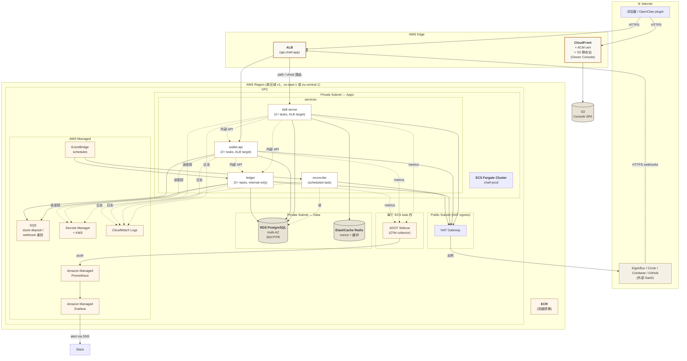

# 05 — Deployment Topology

## 这张图回答什么

**v1 在 AWS 上长什么样？哪些东西在 VPC 里，哪些在外面？流量怎么进来？**

聚焦运行期视图。CI/CD pipeline 和 IaC 工具放最后简述。

## 图



## 关键说明

### 网络分层

| 层 | 内容 | 暴露面 |
|---|---|---|
| Edge | CloudFront + ALB + ACM cert | 公网 HTTPS |
| Public Subnet | 仅 NAT Gateway | 不放任何应用 |
| Private Subnet (Apps) | ECS Fargate tasks | 仅 ALB / 内部 |
| Private Subnet (Data) | RDS / Redis | 仅 Apps subnet |

应用 task 不能直接出公网 → 经 NAT。这是基础合规线。

### 单区域 v1，多区域留 v2

v1 邀请制 5–20 用户 + B-pilot 流量，单区域 multi-AZ 已够 RPO/RTO。多区域延迟 / 数据复制 / 路由复杂度成本和 v1 收益不匹配。区域选择由 Eigenflux 主网络位置决定（美东 / 欧中），保持低延迟即可。

### Secrets / KMS 的关键边界

- Circle entity secret：**仅 wallet-api** task 角色可读
- HMAC master key：**仅 skill-server** task 角色可读
- Owner session 签名 key：**仅 wallet-api**
- 任何 task 角色都不能读所有 secret —— IAM least-privilege

### 监控 fan-out

每个 task 内置一个 ADOT sidecar，应用代码通过 OTel SDK 暴露 `/metrics` → ADOT collector pull → push 到 AMP → AMG dashboard / 告警 → SNS → Slack。

OpenTelemetry 是从 day 1 就装好的（即便 v1 不上 trace）。详见 [ADR-006](06-decisions/adr-006-amp-amg-observability.md)。

### CI/CD 简述

```
GitHub repo (chief/) ──┬─► GitHub Actions
                       │     ├─► test
                       │     ├─► build container image
                       │     ├─► push to ECR
                       │     └─► trigger Terraform apply (staging auto, prod 手动 gate)
                       │
                       └─► OpenClaw plugin repo
                             ├─► test
                             └─► GitHub Release (用户从这里安装)
```

### 备份 / DR

| 资产 | 备份策略 | 恢复目标 |
|---|---|---|
| RDS | 自动每日 snapshot + PITR 30d | RPO ≤ 5min, RTO ≤ 1h |
| `events` 表（M5 raw + audit） | RDS 备份覆盖；额外每周导出到 S3 (Glacier) | 1 年保留 |
| Secrets Manager | KMS rotation + 跨 AZ replication | 立即可用 |
| ECR | 多版本保留 | 立即可用（rollback） |
| Console (S3) | 版本化 + CloudFront cache | 立即可用 |

### 平台 freeze 的"硬" kill-switch

`platform_state.frozen=true` 是 PG 里一行。所有 task 入口路径都读它（缓存 ≤ 10s）。这是 Reconciliation 失败 / on-call 紧急介入时的最快停机闸门，**不依赖部署或新发版**。

## 不在这一层

- IAM policy 详细 JSON（→ Terraform 代码）
- Terraform module 结构（→ Terraform 仓库 README）
- VPC CIDR / 子网划分细节（→ Terraform 代码）
