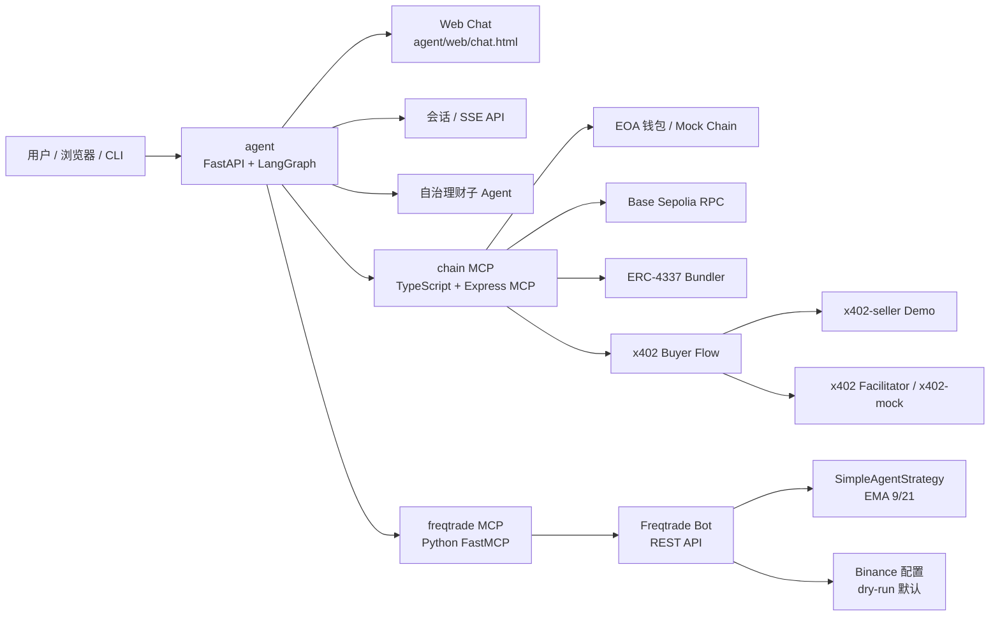

# OntologyAgent 项目总结

> 生成日期：2026-04-20  
> 适用范围：当前仓库根目录下的 `agent`、`chain`、`freqtrade`、`x402-seller`、`x402-mock`、`scripts` 与现有设计/计划文档。

## 1. 项目定位

OntologyAgent 是一个围绕“金融助理 + 链上执行 + 量化交易 + x402 付费资源访问”的多服务原型项目。它使用 MCP（Model Context Protocol）把链上能力和 Freqtrade 交易能力封装成工具，由 Python Agent 统一发现、编排和调用。

项目当前主要目标包括：

- 让用户通过 Web 控制台、HTTP API 或 CLI 脚本与金融管家对话。
- 通过 `chain` MCP 服务执行链上钱包查询、签名、交易提交、ERC-4337 UserOperation、x402 buyer flow 与交易意图执行。
- 通过 `freqtrade` MCP 服务读取交易状态、评估策略信号、管理 Freqtrade dry-run 交易和资金快照。
- 通过后台自治循环观察钱包余额、dry-run 盈亏和风险阈值，并做保护性决策。
- 提供本地 demo seller、mock facilitator 和脚本，方便在 mock 或 Base Sepolia 环境里回归验证。

## 2. 总体架构



关键设计原则：

- `agent` 是唯一面向用户的自然语言编排层，不直接承载链上或交易业务能力。
- `chain` 是链上能力边界，所有钱包、交易、UserOperation、x402 buyer 和链上 trade intent 执行都通过它完成。
- `freqtrade` 是中心化交易和量化能力边界，所有 Freqtrade 状态查询、策略信号、交易管理和 dry-run 账本都通过它完成。
- 写操作默认受多层保护：Agent 提示约束、链上白名单/额度策略、Freqtrade 写操作开关、自治风险阈值、dry-run 默认配置。

## 3. 目录与职责

| 路径 | 职责 |
| --- | --- |
| `README.md` | 项目主说明，包含启动方式、MCP 工具清单、自治运行和 demo 脚本说明。 |
| `docker-compose.yml` | 一键编排 `agent`、`chain`、`freqtrade`、`x402-seller`、`x402-mock` 五个服务。 |
| `agent/` | Python Agent 本体，提供 FastAPI、LangGraph ReAct Agent、会话 API、SSE 流式输出、MCP 客户端和自治控制器。 |
| `chain/` | TypeScript 链上 MCP 服务，提供钱包状态、签名、交易提交、ERC-4337、x402、trade intent 与策略守卫。 |
| `freqtrade/` | Freqtrade + MCP 单容器服务，封装交易状态、策略信号、dry-run 资金、强制开仓/平仓等工具。 |
| `freqtrade/strategies/` | Freqtrade 策略目录，当前默认策略为 `SimpleAgentStrategy.py`。 |
| `x402-seller/` | 本地 x402 seller demo 资源服务，用于验证 paid resource 流程。 |
| `x402-mock/` | 本地 mock facilitator，支持 `CHAIN_MOCK=true` 下的 x402 回归。 |
| `scripts/` | demo 与交互脚本，包括 Agent chat、chain MCP demo、freqtrade MCP demo、Simplescraper live x402 验证。 |
| `docs/superpowers/specs/` | 历史设计规格文档。 |
| `docs/superpowers/plans/` | 历史实施计划文档。 |
| `deep-research-report.md` | 深度研究报告。 |

## 4. 服务拆解

### 4.1 `agent`：自然语言编排与自治入口

`agent` 是项目的主入口服务，基于 FastAPI 暴露 HTTP API，并用 LangGraph `create_react_agent` 构建工具调用型金融助理。

核心能力：

- Web 控制台：`GET /` 与 `GET /chat` 返回 `agent/web/chat.html`。
- 健康检查：`GET /health` 汇总 chain MCP、freqtrade MCP、钱包、Freqtrade 状态和自治状态。
- 单轮调用：`POST /agent/run`。
- 会话调用：`POST /agent/sessions`、`GET /agent/sessions/{session_id}`。
- 流式对话：`POST /agent/sessions/{session_id}/messages/stream`，使用 Server-Sent Events 输出 `start`、`delta`、`final`、`error` 事件。
- MCP 工具发现：启动或健康检查时从 `CHAIN_MCP_URL` 与 `FREQTRADE_MCP_URL` 获取工具列表，并只暴露实际可用工具。
- 本地 wealth 工具：把自治控制器包装为 `get_wealth_status`、`start_wealth_agent`、`stop_wealth_agent`、`run_wealth_tick`。
- 交易意图桥接：`execute_freqtrade_trade_intent` 先让 Freqtrade 生成 trade intent，再交给 chain 执行。

重要实现文件：

- `agent/main.py`：FastAPI 路由、LangGraph Agent、工具注册、MCP discovery、会话与 SSE 逻辑。
- `agent/autonomy.py`：后台自治控制器、风险账本、阈值、计划意图、执行与持久化。
- `agent/autonomy_models.py`：Runtime ledger、intent、execution、policy 等 Pydantic 模型。
- `agent/autonomy_workflows.py`：交易保护动作和链上执行确认流程。
- `agent/chain_mcp_client.py`、`agent/freqtrade_mcp_client.py`：Streamable HTTP MCP 客户端与响应归一化。

### 4.2 `chain`：链上 MCP skill provider

`chain` 是 TypeScript MCP 服务，运行在 Express + MCP Streamable HTTP 上，默认监听 `8091`。它承载所有链上相关能力，并通过 `PolicyGuard` 统一执行地址白名单、单笔上限、日额度和 x402 资产/网络限制。

MCP 工具：

| 工具 | 说明 |
| --- | --- |
| `chain_get_wallet_state` | 返回 signer 地址、钱包余额、链状态、策略额度和 x402 配置摘要。 |
| `chain_sign_transfer` | 签名 ETH 转账但不广播。 |
| `chain_submit_execution` | 提交普通链上交易。 |
| `chain_execute_trade_intent` | 执行来自 Freqtrade 的交易意图；V1 mock 模式可提交，network 模式暂未配置报价执行。 |
| `chain_get_transaction_receipt` | 查询交易 receipt 与确认状态。 |
| `chain_get_user_operation_status` | 查询 ERC-4337 UserOperation 状态。 |
| `chain_submit_user_operation` | 通过 bundler 提交 ERC-4337 UserOperation。 |
| `chain_x402_fetch` | 对 x402 付费上游执行 402 challenge、付款签名和重试访问流程。 |

重要实现文件：

- `chain/src/mcp/server.ts`：MCP HTTP endpoint。
- `chain/src/mcp/tools.ts`：MCP 工具注册与 runtime 组装。
- `chain/src/config.ts`：环境变量解析、默认 Base Sepolia/x402 配置、私钥归一化。
- `chain/src/policies/policy-guard.ts`：链上和 x402 风控策略。
- `chain/src/services/*`：钱包状态、签名、执行、UserOperation、receipt、x402、trade intent 等业务服务。
- `chain/src/infra/*`：RPC client、EOA sender、mock sender、private key signer。

默认链与协议：

- RPC：`https://base-sepolia-rpc.publicnode.com`
- Chain ID：`84532`
- x402 network：`eip155:84532`
- facilitator：`https://x402.org/facilitator`
- x402 资产：Base Sepolia USDC

### 4.3 `freqtrade`：量化交易 MCP skill provider

`freqtrade` 基于官方 `freqtradeorg/freqtrade:stable` 镜像运行。容器入口 `freqtrade/run_stack.py` 会先启动 Freqtrade bot，再等待 REST API 就绪，最后启动 MCP 服务。

MCP 工具：

| 工具 | 类型 | 说明 |
| --- | --- | --- |
| `get_trading_status` | 只读 | 返回当前 active trades、runmode、dry_run、exchange、strategy 等摘要。 |
| `evaluate_trade_signal` | 只读 | 对默认 `ETH/USDC` 运行策略信号评估，返回 `buy`、`sell` 或 `hold`。 |
| `list_strategies` | 只读 | 列出策略目录中的策略，并返回当前 active strategy。 |
| `get_open_trades` | 只读 | 分页读取 open trades。 |
| `get_closed_trades` | 只读 | 分页读取 closed trades。 |
| `get_performance_summary` | 只读 | 合并 profit、performance、balance 快照。 |
| `get_budget_snapshot` | 只读 | 返回 dry-run wallet、stake、open trades、PnL 和 balance 信息。 |
| `sync_dry_run_wallet` | 写入 | 修改 Freqtrade 配置中的 `dry_run_wallet`，建议重启生效。 |
| `start_bot` / `stop_bot` | 写入 | 调用 Freqtrade REST API 启停 bot。 |
| `pause_trading` / `resume_trading` | 写入 | 分别映射到 stop/start。 |
| `emit_trade_intent` | 生成意图 | 生成供 `chain_execute_trade_intent` 使用的 trade intent。 |
| `force_enter_trade` | 写入 | 调用 Freqtrade `forceenter`。 |
| `force_exit_trade` | 写入 | 调用 Freqtrade `forceexit`，自治保护动作会使用该能力。 |

默认策略：

- 文件：`freqtrade/strategies/SimpleAgentStrategy.py`
- 周期：`5m`
- 指标：EMA 9 与 EMA 21
- 入场：EMA 9 上穿 EMA 21
- 出场：EMA 9 下穿 EMA 21
- 默认交易对：`ETH/USDC`
- 默认 dry-run wallet：`1000`
- 默认 stake amount：`100`
- 默认最大持仓数：`3`

### 4.4 `x402-seller` 与 `x402-mock`

`x402-seller` 是本地 demo paid resource 服务：

- `GET /health`：健康检查。
- `GET /x402/demo-resource`：如果没有有效付款头，返回 x402 challenge；验证并结算成功后返回 demo 资源。

`x402-mock` 是本地 mock facilitator：

- `GET /health`：健康检查。
- `POST /x402/facilitator/verify`：mock verify。
- `POST /x402/facilitator/settle`：mock settle。

这两个服务主要服务于 `scripts/demo-chain-mcp.sh` 和 `CHAIN_MOCK=true` 的本地回归。

## 5. 运行方式

### 5.1 一键启动

在仓库根目录执行：

```bash
docker compose up -d --build
```

默认入口：

| 服务 | 地址 |
| --- | --- |
| Agent 健康检查 | `http://localhost:8000/health` |
| Agent Web 控制台 | `http://localhost:8000/` |
| Agent 单轮调用 | `POST http://localhost:8000/agent/run` |
| Agent 会话创建 | `POST http://localhost:8000/agent/sessions` |
| Agent 流式消息 | `POST http://localhost:8000/agent/sessions/{session_id}/messages/stream` |
| Chain MCP | `http://localhost:8091/mcp/` |
| Freqtrade REST API | `http://localhost:8080/api/v1` |
| Freqtrade MCP | `http://localhost:8090/mcp/` |
| x402 seller demo | Docker 网络内地址为 `http://x402-seller:8000/x402/demo-resource`；默认未映射到宿主机端口 |

### 5.2 交互与 demo 脚本

| 脚本 | 用途 |
| --- | --- |
| `scripts/agent-chat.sh` | 终端对话脚本，支持 `/wealth-status`、`/wealth-start`、`/wealth-stop`、`/wealth-tick`；但当前脚本仍调用 `/messages`，需要与后端现有 `/messages/stream` 路由对齐后再算完全匹配。 |
| `scripts/demo-chain-mcp.sh` | 启动完整 compose 栈，发现 chain MCP tools，并调用签名、x402、普通交易、UserOperation demo。 |
| `scripts/demo-freqtrade-mcp.sh` | 启动 Agent/chain/freqtrade，发现 Freqtrade MCP tools，并调用 `get_trading_status`。 |
| `scripts/live-x402-simplescraper.sh` | 使用 live Base Sepolia 配置，通过 `chain_x402_fetch` 请求 Simplescraper x402 endpoint。 |

### 5.3 Worktree 环境变量注意事项

如果在 `.worktrees/...` 目录执行 `docker compose`，Compose 默认读取当前目录的 `.env`，不会自动回退主仓库 `.env`。这可能导致 `PRIVATE_KEY`、`OPENAI_API_KEY`、`OPENAI_BASE_URL` 等变量为空。

推荐显式指定主仓库 `.env`：

```bash
docker compose --env-file "$(dirname "$(git rev-parse --git-common-dir)")/.env" up -d
```

## 6. 关键配置

### 6.1 Agent 配置

| 变量 | 默认值 | 说明 |
| --- | --- | --- |
| `OPENAI_API_KEY` | 空 | Agent 调用模型所需 API key。 |
| `OPENAI_BASE_URL` / `OPENAI_ENDPOINT` | 空 | 自定义模型 API base URL。 |
| `BRAIN_AGENT_MODEL` | `gpt-4o-mini` | 主 Agent 默认模型。 |
| `CHAIN_MCP_URL` | `http://chain-mcp:8091/mcp/` | Chain MCP 地址。 |
| `FREQTRADE_MCP_URL` | `http://freqtrade:8090/mcp/` | Freqtrade MCP 地址。 |
| `AUTONOMY_ENABLED` | `false` | 是否启动时自动运行自治循环。 |
| `AUTONOMY_INTERVAL_SECONDS` | `60` | 自治循环间隔。 |
| `AUTONOMY_STATE_PATH` | `/app/data/autonomy_state.json` | 自治账本持久化路径。 |
| `AUTONOMY_ETH_PRICE_USD` | `3000` | 自治估值使用的 ETH/USD 静态价格。 |
| `AUTONOMY_MODEL` | 空 | 自治模型；为空时回退 `BRAIN_AGENT_MODEL`。 |

### 6.2 Chain 配置

| 变量 | 默认值 | 说明 |
| --- | --- | --- |
| `PRIVATE_KEY` | 空 | 链上签名私钥；未配置时签名/发送类能力不可用。 |
| `RPC_URL` | Base Sepolia public RPC | EVM RPC URL。 |
| `CHAIN_ID` | `84532` | 期望链 ID。 |
| `CHAIN_MOCK` | `false` | 是否使用 mock chain。 |
| `CHAIN_MOCK_BALANCE_ETH` | `1.0` | mock 钱包余额。 |
| `DAILY_LIMIT` | `2.0` | ETH 日额度。 |
| `SINGLE_TX_CAP` | `1.0` | ETH 单笔上限；代码内还有硬上限 `1.0 ETH`。 |
| `WHITELISTED_RECIPIENTS` | 空 | 额外白名单地址，逗号分隔。 |
| `BUNDLER_RPC_URL` | 空 | ERC-4337 bundler RPC。 |
| `X402_FACILITATOR_URL` | `https://x402.org/facilitator` | x402 facilitator 地址。 |
| `X402_NETWORK` | `eip155:84532` | x402 网络。 |
| `X402_BUYER_PRIVATE_KEY` | 空 | x402 buyer 私钥；为空时回退 `PRIVATE_KEY`。 |
| `X402_USDC_SINGLE_CAP` | `1.0` | x402 USDC 单次上限。 |
| `X402_USDC_DAILY_CAP` | `2.0` | x402 USDC 日上限。 |

### 6.3 Freqtrade 配置

| 变量 | 默认值 | 说明 |
| --- | --- | --- |
| `FREQTRADE_USERNAME` | `freqtrade` | REST API basic auth 用户名。 |
| `FREQTRADE_PASSWORD` | `freqtrade` | REST API basic auth 密码。 |
| `FREQTRADE_ALLOW_WRITE_ACTIONS` | `true` | 是否允许 MCP 写操作。 |
| `FREQTRADE_API_URL` | `http://127.0.0.1:8080/api/v1` | Freqtrade REST API 地址。 |
| `FREQTRADE_MCP_PORT` | `8090` | Freqtrade MCP 端口。 |
| `FREQTRADE_CONFIG_PATH` | `/app/config/config.json` | Freqtrade 配置路径。 |
| `FREQTRADE_STRATEGY_PATH` | `/app/strategies` | 策略目录。 |
| `FREQTRADE_STRATEGY_NAME` | `SimpleAgentStrategy` | 默认策略名。 |

## 7. 核心业务流程

### 7.1 用户对话到工具调用

1. 用户通过 Web、`POST /agent/run` 或 session API 发送自然语言指令。
2. `agent` 使用系统提示约束模型：链上动作只能调用 chain MCP，交易动作只能调用 Freqtrade MCP。
3. `agent` 根据已发现工具构建 LangGraph ReAct Agent。
4. 模型如需执行动作，会调用本地包装工具；包装工具再通过 MCP client 调用对应后端。
5. 结果被归一化后返回给模型，并最终生成自然语言回复。

### 7.2 x402 付费资源访问

1. 用户或 Agent 调用 `chain_x402_fetch`。
2. `chain` 先请求上游资源。
3. 如果上游返回 `402`，`X402FetchService` 解析 challenge。
4. `PolicyGuard` 校验 payTo 白名单、网络、资产、单次/日额度。
5. x402 client 生成付款签名头并重试请求。
6. 上游返回资源和 `PAYMENT-RESPONSE` 后，chain 记录 x402 spend 并返回摘要。

### 7.3 Freqtrade 信号与交易意图

1. `evaluate_trade_signal` 对默认 `ETH/USDC` 读取 candles 与当前 open position。
2. 默认策略计算 EMA 9/21 crossover。
3. MCP 返回 `buy`、`sell` 或 `hold`，附带 reason、confidence、position context。
4. 如果需要从 Freqtrade intent 走链上执行，Agent 调用 `execute_freqtrade_trade_intent`：
   - Freqtrade `emit_trade_intent` 生成标准化 intent。
   - Agent 将 intent 转换成 chain payload。
   - chain `chain_execute_trade_intent` 执行或拒绝该 intent。

### 7.4 自治理财子 Agent

自治循环默认关闭，避免启动即触发资产相关动作。启用后：

1. 周期读取 `chain_get_wallet_state` 与 `get_budget_snapshot`。
2. 初始化或更新风险账本。
3. 计算钱包 USD 估值、dry-run PnL、净值、回撤、open trade 数量。
4. 根据阈值推导允许动作：`hold`、`stop_trading`、`force_exit_all`、`request_funding`。
5. 对保护动作执行 policy 检查。
6. 对 Freqtrade 保护动作执行强制退出或停机。
7. 对链上动作记录 execution，并通过 receipt/UserOperation status 后续确认。
8. 将状态写入 `agent/data/autonomy_state.json`。

## 8. 安全与风控边界

当前项目已有以下防护：

- **职责隔离**：Agent 不直接执行链上或交易动作，必须通过 MCP 工具边界。
- **链上白名单**：`PolicyGuard` 要求目标地址在硬编码白名单或 `WHITELISTED_RECIPIENTS` 中。
- **链上额度**：普通 ETH 动作有单笔上限和日额度。
- **x402 限额**：x402 只允许配置网络和资产，并有 USDC 单次/日额度。
- **链 ID 校验**：network 模式执行前会校验 RPC chain ID。
- **写操作开关**：`FREQTRADE_ALLOW_WRITE_ACTIONS=false` 时会拒绝 Freqtrade 写操作。
- **dry-run 默认**：Freqtrade 默认 `dry_run=true`，适合本地和测试环境。
- **自治默认关闭**：`AUTONOMY_ENABLED=false`，需要显式启动或调用 `/autonomy/start`。
- **状态透明**：`GET /health` 与 `/autonomy/status` 会暴露工具、钱包、交易和自治摘要。

仍需注意：

- `freqtrade/config/config.json` 中包含演示用 exchange key/secret，真实部署前必须替换为安全的 secret 注入方式。
- `PolicyGuard` 的日额度计数当前在进程内存中，服务重启后会重置。
- Agent session store 当前在内存中，服务重启后会话丢失。
- `AUTONOMY_ETH_PRICE_USD` 是静态估值，不是实时价格源。
- `chain_execute_trade_intent` 的 network 执行路径当前返回“报价执行源未配置”，V1 主要支持 mock trade intent。
- `scripts/agent-chat.sh` 当前仍请求 `/agent/sessions/{id}/messages`，而后端实际公开的是 `/messages/stream`。
- `x402-seller` 在默认 Compose 配置下没有映射宿主机端口，需要通过容器网络或额外端口映射访问。

## 9. 测试与验证

仓库包含 Python 与 TypeScript 测试：

| 模块 | 测试目录 | 建议命令 |
| --- | --- | --- |
| Agent | `agent/tests/` | `cd agent && python -m pytest` |
| Chain | `chain/test/` | `cd chain && npm test` |
| Chain 类型检查 | `chain/src/` | `cd chain && npm run typecheck` |
| Freqtrade MCP / Strategy | `freqtrade/tests/` | `cd freqtrade && python -m pytest` |
| x402 seller | `x402-seller/tests/` | `cd x402-seller && python -m pytest` |
| Compose 集成 | 根目录 | `docker compose up -d --build` 后访问 `http://localhost:8000/health` |

demo 验证命令：

```bash
CHAIN_MOCK=true ./scripts/demo-chain-mcp.sh
./scripts/demo-freqtrade-mcp.sh
PRIVATE_KEY=0x... ./scripts/live-x402-simplescraper.sh
```

## 10. 当前成熟度与限制

当前项目处于功能原型/集成验证阶段，主要成熟能力是：

- 多服务 compose 编排。
- Agent 对 chain/freqtrade MCP tools 的发现与调用。
- Web/HTTP/CLI 多入口交互。
- x402 本地 mock 与 live endpoint 验证脚本。
- Freqtrade dry-run 状态读取和默认策略信号评估。
- 自治账本和保护性动作框架。

主要限制是：

- 生产级密钥管理、审计日志、持久化额度账本尚未完善。
- Agent 会话、链上 policy spend、部分运行状态仍为内存态。
- 交易意图的真实链上成交路径仍是 V1 mock/占位能力。
- Freqtrade 默认配置适合 demo，不应直接作为生产交易配置。
- Web 控制台是轻量页面，尚不是完整运营后台。
- 部分脚本依赖 Docker Compose、curl、Python 和容器内依赖环境。

## 11. 建议后续文档

为了让项目更易交接和上线，建议继续补充：

- `.env.example`：列出所有必需和可选环境变量，标注 mock/live 场景。
- `docs/api-reference.md`：整理 Agent HTTP API、SSE 事件和 MCP tool schema。
- `docs/security-model.md`：单独说明密钥、白名单、额度、x402、dry-run 与自治风险边界。
- `docs/deployment.md`：说明本地、测试网、生产环境的部署差异。
- `docs/runbook.md`：整理健康检查、常见错误、重启顺序和排障命令。
- `docs/freqtrade-strategy.md`：详细说明策略参数、信号解释、回测/实盘差异。
